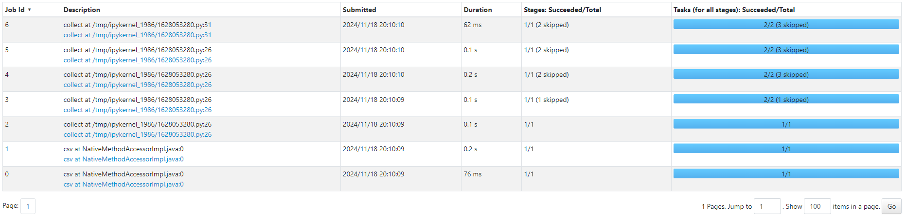

# Homework 4: Apache Spark. Optimisation and SparkUІ

## Part 1: 


## Part 2: 
Adding Action — `collect` :


## Part 3:
Using `cashe` function:


## Conclusion:

The main difference between the codes used in Task 2 and Task 3 is the addition of the cache function in Task 3:

```python
nuek_processed_cached = nuek_repart \\
    .where("final_priority < 3") \\
    .select("unit_id", "final_priority") \\
    .groupBy("unit_id") \\
    .count() \\
 ** .cache() **  # Додано функцію cache

# Проміжний action: collect
nuek_processed_cached.collect()

# Ось ТУТ додано рядок
nuek_processed = nuek_processed_cached.where("count>2")

nuek_processed.collect()
```

The `cache` function stores the intermediate results (`nuek_processed_cached`) in memory. This optimization ensures that the intermediate computation (the `.count()` result) is reused efficiently. Without caching, every subsequent action (like `collect`) would re-trigger the computation from the beginning. Thus, in Task 3, the `count` operation is executed only once and reused, improving performance.
